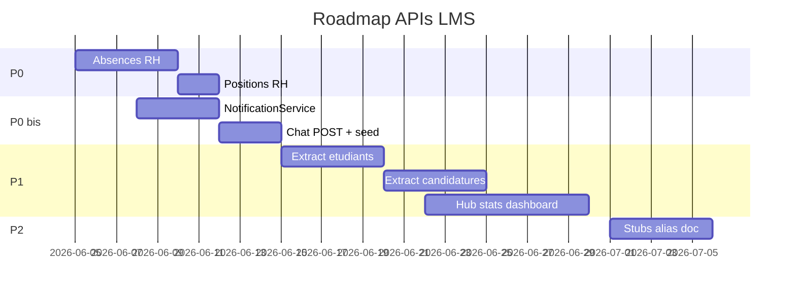

# Cahier de route — APIs LMS (CRM, Landing, Auth, Topbar)

**Projet :** `app-prisma` (monorepo LMS)  
**Date :** juin 2026  
**Objectif :** rectifier la dette API (stubs, catch-all, KPIs faux), maximiser l’efficacité maintenance, et finaliser la couche **transversale** (notifications + chat header).  
**Références :** `.cursor/rules/monorepo-feature-workflow.mdc` · audit précédent `docs/API_AUDIT_REFACTOR.md` (obsolète partiellement — ce document fait foi).

---

## 1. Vision cible

### Principes non négociables

| # | Règle |
|---|--------|
| 1 | **Un domaine métier = un dossier** sous `apps/lms-crm/app/api/sections/{section}/…` aligné sur `config/menu.config.tsx`. |
| 2 | **Pas de logique métier** dans un catch-all ; le catch-all ne sert qu’à des **redirects HTTP 308** temporaires (max 1 sprint). |
| 3 | **Prisma unique** : `packages/database` — jamais de client local par app. |
| 4 | **Réponses CRM** : `ok(data)` / `fail(message, status)` via `app/api/_shared/http/response.ts`. |
| 5 | **Stats lourdes** : `packages/api-core` (`StatService`, `ModuleWorkspaceService`) + cache Redis si besoin. |
| 6 | **Transversal header** : tout ce qui sert **toutes les pages** reste sous `app/api/common/` (notifications, chat, fichiers, topbar). |
| 7 | **Landing** : API publiques courtes sous `apps/lms-landing/app/api/` — pas de duplication du arbre `sections/*`. |

### Architecture cible (simplifiée)

```txt
apps/lms-crm/app/api/
  _shared/          # response, topbar-auth, serialize helpers
  auth/             # NextAuth + flux mot de passe (hors sections)
  common/           # topbar, notifications, chat, files, health
  dashboard/        # hub accueil + ?section=
  public/           # plaquettes devis (sans session)
  admin/            # ops système
  sections/         # métier par menu
    workspace/[viewKey]
    gestion-ressources/rh/{collaborateurs,absences,equipes,positions,etudiants,candidatures,candidathub,…}
    gestion-academique/vie-scolaire/…
    …

apps/lms-landing/app/api/
  catalog/, preinscriptions/, quote-requests/, contact/, landing/config, seo/redirect

packages/api-core/
  StatService, ModuleWorkspaceService, NotificationService (à créer), …
```

---

## 2. État des lieux (snapshot)

### 2.1 Ce qui est déjà sain

- **Finance, sessions, inventaire, accès IAM, équipes/org-units** : routes dédiées + Prisma.
- **Workspace** : `/api/sections/workspace/[viewKey]` + `ModuleWorkspaceService`.
- **Topbar APIs** : implémentées et branchées UI (`lib/topbar-api.ts`, `use-topbar-summary.ts`).
- **Landing** : 7 routes actives, séparées du CRM.

### 2.2 Dette prioritaire

| Problème | Impact |
|----------|--------|
| `gestion-ressources/[...path]` ~1500 lignes | Mélange métier réel + stubs + forwards → risque régression |
| `rh/absences` stub | Page RH + 10+ onglets « absences » sur fiches → **données vides** |
| `rh/positions` absent | `RhOrgUnit.positionId` sans modèle ni API → select postes cassé |
| ~35 hubs appellent `rh/collaborateurs/stats` | Graphiques **non sémantiques** (SEO, tickets, finance…) |
| Bloc stub `rh/absences` dans catch-all | **Code mort** (route dédiée prioritaire) |
| `rh/compliance` vs `rh/conformite` | Alias legacy, confusion |
| `InAppNotification` | **Lecture seule** — aucun producteur métier dans le repo |
| Chat `conversations` | **GET seulement** — pas de création de conversation via API |
| Menu `/account/notifications` | **Page inexistante** — seul le sheet header fonctionne |

---

## 3. Plan par phases

### Légende statuts tâches

- `[ ]` à faire · `[~]` en cours · `[x]` fait  
- **Effort :** S (&lt;1j) · M (1–3j) · L (&gt;3j)

---

## Phase P0 — Produit bloquant (RH + positions)

**Objectif :** les écrans déjà en production affichent des données réelles.

### P0.1 — Modèle et API `rh/absences`

| # | Tâche | Effort | Fichiers / notes |
|---|--------|--------|------------------|
| P0.1.1 | Définir le modèle Prisma `RhAbsence` (userId, type, startDate, endDate, status, comment, validatedBy?, createdAt) + enum statut | M | `packages/database/prisma/schema.prisma` |
| P0.1.2 | `pnpm db:generate` + `pnpm db:push` (ou migration nommée) | S | racine monorepo |
| P0.1.3 | Remplacer stub `rh/absences/[[...path]]/route.ts` par CRUD réel (GET liste paginée + filtres `userId`, `status` ; GET/PATCH/DELETE `:id` ; POST création) | M | Copier pattern `rh/equipes/[[...path]]` |
| P0.1.4 | Ajouter `rh/absences/stats/route.ts` ou segment `…/stats` dans `[[...path]]` — KPIs réels (en cours, validées, par type) | S | Aligner `absence-stats.tsx` |
| P0.1.5 | Helper `_lib/rh-absences-serialize.ts` | S | Colocalisé API |
| P0.1.6 | Seed minimal (2–3 absences démo) | S | `packages/database/prisma/seed.js` |
| P0.1.7 | **Supprimer** le bloc `joined.startsWith('rh/absences')` dans `gestion-ressources/[...path]/route.ts` | S | Évite double maintenance |
| P0.1.8 | Tests manuels : page `/gestion-ressources/rh/absences`, onglets fiches collaborateur / user-absences | S | Checklist §7 |

**Critères d’acceptation P0.1 :** liste non vide après seed ; création depuis `absence-add-sheet` ; stats non `{}` ; plus de `migrated: false`.

### P0.2 — `rh/positions` (postes / fonctions)

`RhOrgUnit` expose déjà `positionId` (string) sans table — **décision produit** :

| Option | Description | Recommandation |
|--------|-------------|----------------|
| **A** | Nouveau modèle `RhPosition` (id, label, code?, orgUnitType?) | ✅ Si référentiel postes stable |
| **B** | Liste statique seed + `positionId` = slug | Prototype rapide |
| **C** | Dériver des `UserRole` / métiers existants | Si poste = rôle IAM uniquement |

| # | Tâche | Effort |
|---|--------|--------|
| P0.2.1 | Valider option A/B/C avec métier | S |
| P0.2.2 | Schema + seed positions | S–M |
| P0.2.3 | `app/api/sections/gestion-ressources/rh/positions/route.ts` — GET liste `{ id, label }` | S |
| P0.2.4 | Brancher `org-unit-add-sheet.tsx` (déjà appelle `/rh/positions`) | S |
| P0.2.5 | Optionnel : PATCH org-unit pour lier `positionId` | S |

**Critères d’acceptation P0.2 :** le select « poste » dans création unité org n’est plus vide ; pas de 501 sur `/rh/positions`.

---

## Phase P0 bis — Topbar : notifications & chat (header)

**Objectif :** la cloche et la messagerie du header sont **utiles en production**, pas seulement des coquilles UI.

### Contexte actuel

| Composant | API | UI | Écart |
|-----------|-----|-----|-------|
| Badge compteurs | `GET /api/common/topbar/summary` | `use-topbar-summary` (poll 30s) | OK |
| Liste notifications | `GET/PATCH /api/common/notifications` | `notifications-sheet.tsx` | **Aucune création** `inAppNotification` côté métier |
| Détail notif | `PATCH /api/common/notifications/[id]` | OK | — |
| Conversations | `GET /api/common/chat/conversations` | `chat-sheet.tsx` (poll 20s si ouvert) | **Pas de POST** conversation |
| Messages | `GET/POST …/conversations/[id]/messages` | OK si conversation existe | — |
| Préférences email | `POST …/acces/settings/notifications` | Page paramètres | ≠ notifications in-app (ne pas fusionner) |

### P0 bis.1 — Service d’émission notifications

| # | Tâche | Effort |
|---|--------|--------|
| N.1 | Créer `NotificationService` dans `packages/api-core` : `emit({ userId, category, title, body, href?, metadata? })` | M |
| N.2 | Appeler le service depuis événements métier (minimum viable) : | M |
| | • ticket créé / assigné → `TICKET` | |
| | • devis envoyé / accepté → `FINANCE` | |
| | • candidature statut changé → `ACADEMIC` | |
| | • membre ajouté à équipe RH → `TEAM` | |
| N.3 | Documenter le catalogue catégories (`InAppNotificationCategory`) | S |
| N.4 | Seed 5 notifications démo pour compte admin | S |

### P0 bis.2 — Chat header complet

| # | Tâche | Effort |
|---|--------|--------|
| C.1 | `POST /api/common/chat/conversations` — créer DIRECT (2 users) ou GROUP (titre + participantIds) | M |
| C.2 | Seed : 1 conversation démo admin ↔ collaborateur | S |
| C.3 | UI : bouton « Nouvelle conversation » dans `chat-sheet.tsx` (select user CRM) | M |
| C.4 | Invalidation React Query après envoi message (`queryClient.invalidateQueries`) | S |

### P0 bis.3 — UX header & menu

| # | Tâche | Effort |
|---|--------|--------|
| U.1 | Créer page `app/(protected)/account/notifications/page.tsx` **ou** retirer entrées menu `/account/notifications` | S |
| U.2 | Lien « Voir tout » dans `notifications-sheet` → page liste complète (pagination) | S |
| U.3 | Centraliser types dans `lib/topbar-api.ts` (déjà fait) — ne pas dupliquer dans composants | S |

### P0 bis.4 — Évolution (P1+, pas bloquant MVP)

| # | Tâche | Notes |
|---|--------|-------|
| N+.1 | SSE ou WebSocket pour badge temps réel (au lieu poll 30s) | `packages/workers` ou route dédiée |
| N+.2 | Préférences utilisateur : opt-out par catégorie (table `UserNotificationPreference`) | Distinct de `systemSetting` email |
| C+.2 | Pièces jointes chat via `@repo/storage` + `common/files` | — |

**Critères d’acceptation P0 bis :** après action métier (ex. créer ticket), la cloche s’incrémente ; une conversation peut être créée depuis le header ; envoi message met à jour `lastReadAt` et compteur.

---

## Phase P1 — Dette structurelle (extraction catch-all)

**Objectif :** `gestion-ressources/[...path]/route.ts` &lt; 300 lignes (redirects uniquement) ou fichier supprimé.

### P1.1 — Extraction routes RH académiques legacy

Extraire **tel quel** la logique métier actuelle vers fichiers dédiés (puis refactor interne) :

| Route cible | Source actuelle dans `[...path]` | Effort |
|-------------|-----------------------------------|--------|
| `rh/etudiants/route.ts` + `rh/etudiants/[id]/route.ts` + `rh/etudiants/stats/route.ts` | blocs `rh/etudiants` | L |
| `rh/candidatures/route.ts` + `[id]/route.ts` + `stats/route.ts` | blocs `rh/candidatures` | L |
| `rh/candidathub/route.ts` + `stats/route.ts` | blocs `rh/candidathub` (casse normalisée) | M |

| # | Tâche |
|---|--------|
| P1.1.1 | Créer dossiers + déplacer handlers |
| P1.1.2 | Mettre serializers dans `_lib/rh-learners-serialize.ts` (partagé etudiants/candidats) |
| P1.1.3 | Rediriger anciens chemins PascalCase (`CandidatHub`, `Candidatures`) via **rewrite Next** `next.config.mjs` ou handlers minces qui `forwardTo` une seule ligne |
| P1.1.4 | Supprimer code extrait du catch-all |

### P1.2 — KPIs hubs (fin du proxy RH universel)

| # | Tâche | Effort |
|---|--------|--------|
| P1.2.1 | Étendre `GET /api/dashboard/stats?section={slug}` dans `StatService` : `cms`, `seo`, `marketing`, `support`, `securite`, `compagnie`, `finance` (KPIs **réels** par domaine) | L |
| P1.2.2 | Créer hook `useSectionHubStats(section)` remplaçant les appels directs à `collaborateurs/stats` | M |
| P1.2.3 | Migrer composants listés (§4.1) — **un module par PR** | L |
| P1.2.4 | Garder `rh/collaborateurs/stats` **uniquement** pour : hub RH, formateurs (`profileType=formateur`), compagnie si KPI = effectifs RH | S |

**Fichiers UI à migrer (grep `collaborateurs/stats`) :**

- `communication-contenu/{cms,seo,marketing}/components/*-stats.tsx` et `*-evolution-chart.tsx`
- `securite-configuration/{acces,gouvernance,parametres}/components/*`
- `administration-facturation/finance/components/*-chart.tsx`
- `support-qualite/{support,qualite}/components/*`
- `gestion-ressources/compagnie/components/*` (évaluer KPI métier : établissement vs RH)

### P1.3 — Catch-all autres sections

| Fichier | Action |
|---------|--------|
| `administration-facturation/[...path]` | Supprimer après vérification 0 appel UI ; garder `tenant/profile` dédié |
| `gestion-sites-clients/[...path]` | Implémenter `sites/route.ts` réel ou retirer menu |
| `securite-configuration/parametres/[...path]` | Inventorier et migrer vers routes explicites |

---

## Phase P2 — Hygiène & documentation

### P2.1 — Stubs et alias

| # | Tâche |
|---|--------|
| P2.1.1 | Supprimer blocs stub morts dans `[...path]` : `rh/documents`, `rh/certifications` (si route dédiée utilisée), `partenaires/*`, `sites/*` |
| P2.1.2 | **Fusionner** appels UI `rh/compliance/*` → `rh/conformite/*` ; deprecate `compliance/[conformiteId]` |
| P2.1.3 | Documenter forwards : `tenant/profile/stats` → `dashboard/stats` ; `common/stats` → proxy ; `gestion-ressources/tenant/profile/stats` |
| P2.1.4 | `auth/signup` + `verify-email` : marquer `@deprecated` CRM ou retirer routes si signup définitivement off |

### P2.2 — Certifications stats

| # | Tâche |
|---|--------|
| P2.2.1 | Choisir source : `gestion-academique/vie-scolaire/certifications/stats` **ou** `gestion-ressources/rh/certifications/stats` (pas les deux) |
| P2.2.2 | Implémenter via `StatService.getCertificationsStats()` |
| P2.2.3 | Mettre à jour `certification-stats.tsx` |

### P2.3 — Documentation vivante

| # | Livrable |
|---|----------|
| P2.3.1 | `docs/crm-api-map.md` — tableau Page UI → Méthode → URL → Statut (`réel` / `stub` / `proxy` / `legacy`) |
| P2.3.2 | Mettre à jour `apps/lms-crm/app/api/common/README.md` (topbar, notifications, chat) |
| P2.3.3 | Lien depuis `.cursor/rules/monorepo-feature-workflow.mdc` vers ce cahier |

---

## 4. Inventaire transversal (référence rapide)

### 4.1 Auth (`apps/lms-crm/app/api/auth/`)

| Route | Usage | Action roadmap |
|-------|--------|----------------|
| `[...nextauth]` | Session CRM | Conserver |
| `change-password` | Compte connecté | Conserver |
| `reset-password` / `reset-password-verify` | Reset + fiches user | Conserver |
| `signup` / `verify-email` | Inscription | P2 : désactiver ou documenter « landing only » |

### 4.2 Common / Topbar

| Route | Rôle |
|-------|------|
| `common/topbar/summary` | Compteurs badge header |
| `common/notifications` | Liste + read_all / archive_all |
| `common/notifications/[id]` | Marquer lu / archiver |
| `common/chat/conversations` | Liste conversations (**+ POST à ajouter**) |
| `common/chat/conversations/[id]/messages` | Historique + envoi |
| `common/files` | Upload S3 transversal |
| `common/stats` | Proxy → `dashboard/stats` (documenter) |
| `common/health` | Healthcheck |

**Client :** `apps/lms-crm/lib/topbar-api.ts`  
**UI :** `app/components/partials/topbar/{notifications-sheet,chat-sheet}.tsx`  
**Layout :** `app/components/layouts/demo1/components/header.tsx` + `use-topbar-summary.ts`

### 4.3 Landing (`apps/lms-landing/app/api/`)

| Route | Rôle CRM lié |
|-------|----------------|
| `catalog/formation`, `catalog/sessions` | Formations / sessions publiques |
| `preinscriptions` | → `Candidature` + emails `@repo/mail` |
| `quote-requests` | Leads devis |
| `contact` | Contact général |
| `landing/config` | Alimenté par CRM `communication-contenu/cms/landing-config` |
| `seo/redirect` | Cohérent avec CRM `seo/redirections` |

**Ne pas** dupliquer `sections/*` sur la landing.

### 4.4 Hors menu

| Page | APIs |
|------|------|
| `/mon-profil` | Session + `collaborateurs/:id` / `CandidatHub` / `acces/account/profile` |
| Footer Questions | Externe Mintlify (`generalSettings.docsHelpCatalogLink`) |
| Footer Support | Navigation → `/support-qualite/support/tickets` (API tickets sur la page) |

---

## 5. Ordre d’exécution recommandé (sprints)



| Sprint | Contenu | Livrable visible |
|--------|---------|------------------|
| **S1** | P0.1 + P0.2 | Absences + postes fonctionnels |
| **S2** | P0 bis (N + C + U) | Cloche et chat utiles |
| **S3** | P1.1 extractions | Catch-all réduit, routes explicites |
| **S4** | P1.2 stats hubs | Graphiques cohérents par section |
| **S5** | P2 | Alias, certifications, doc `crm-api-map.md` |

---

## 6. Règles de PR (efficacité équipe)

1. **Une PR = un sous-ensemble du cahier** (ex. « P0.1 absences uniquement »).
2. Toute PR touchant le schema : `pnpm db:generate` + note migration dans la description PR.
3. Interdit d’ajouter de nouveaux appels à `collaborateurs/stats` hors modules RH / effectifs.
4. Nouveau endpoint métier → sous `sections/`, jamais racine `app/api/foo`.
5. Événement métier important → appeler `NotificationService.emit` (après S2).
6. Checklist revue :
   - [ ] Session testée (401 si non connecté)
   - [ ] `ok`/`fail` respectés
   - [ ] Pas de `new PrismaClient()` hors `@/lib/prisma`
   - [ ] UI alignée menu si page nouvelle

---

## 7. Checklists de validation

### Absences (P0.1)

- [ ] `GET /api/sections/gestion-ressources/rh/absences` → liste paginée
- [ ] `GET …?userId=` → filtre fiche collaborateur
- [ ] `POST` création + `PATCH` validation/refus
- [ ] Stats page cohérentes
- [ ] Catch-all ne contient plus `rh/absences`

### Positions (P0.2)

- [ ] `GET /api/sections/gestion-ressources/rh/positions` → 200 + tableau
- [ ] Formulaire org-unit : select rempli

### Topbar (P0 bis)

- [ ] Création ticket → notification admin assigné
- [ ] Badge `notificationUnread` &gt; 0 sans seed manuel uniquement
- [ ] `POST` conversation + message → compteur chat OK
- [ ] Poll summary 30s ne spam pas (pas d’erreur 500 en boucle)

### Extraction (P1.1)

- [ ] `rh/etudiants`, `rh/candidatures`, `rh/candidathub` répondent **sans** passer par `[...path]`
- [ ] Tests régression CandidatHub (casse PascalCase URLs)

### Stats hubs (P1.2)

- [ ] Page CMS : graphiques reflètent contenus / leads, pas effectifs RH
- [ ] `dashboard/stats?section=cms` documenté dans `StatService`

---

## 8. Risques & mitigations

| Risque | Mitigation |
|--------|------------|
| Régression massieve catch-all | Extraction par copie + tests manuels CandidatHub / étudiants avant suppression |
| Double route absences | Supprimer stub catch-all dès route dédiée livrée |
| Notifications spam | `emit` idempotent (clé `metadata.eventId`) + rate limit |
| Chat sans modération | Limite taille message + participants CRM uniquement |
| Landing / CRM désync | Single source : formations `gestion-academique`, config `landing-config` |

---

## 9. Suivi

| Document | Rôle |
|----------|------|
| **Ce fichier** | Cahier de route priorisé (référence équipe) |
| `docs/crm-api-map.md` | À créer en P2.3.1 — matrice page/API |
| `docs/API_AUDIT_REFACTOR.md` | Archive / contexte historique — ne pas dupliquer |

**Livraison juin 2026 (agent) :**

- [x] **S1** — `RhAbsence`, API absences, `RhPosition`, `GET /rh/positions`, seed, catch-all absences retiré
- [x] **S2** — `NotificationService`, notif création ticket, `POST /common/chat/conversations`, page `/account/notifications`
- [x] **S3** — `etudiants`, `candidathub`, `candidatures` extraits (GET/stats/POST/PATCH) ; catch-all candidatures retiré
- [x] **S2 suite** — notifs statut candidature, équipe RH, assignation ticket ; UI chat + lien « Voir tout » ; i18n `account.notifications`
- [x] **S3 suite** — `formationsessions/.../participants` extrait ; catch-all &lt; 200 lignes (forwards)
- [x] **S4 suite** — `collaborateurs/stats` : `profileType` (KPIs plats) + `StatService` (hub RH)
- [x] **S4** — `getSectionHubLegacyStats` + migration ~30 composants hubs (script `scripts/migrate-hub-stats-ui.js`)
- [x] **S5** — `rh/certifications/stats`, proxy `rh/compliance` → conformite, `docs/crm-api-map.md`

**Suite recommandée :** migration batch des `*-stats.tsx` / charts restants ; extraction `rh/etudiants` + `rh/candidathub` hors catch-all.

---

*Maintenu par l’équipe LMS — mettre à jour les cases `[x]` à chaque livraison.*
