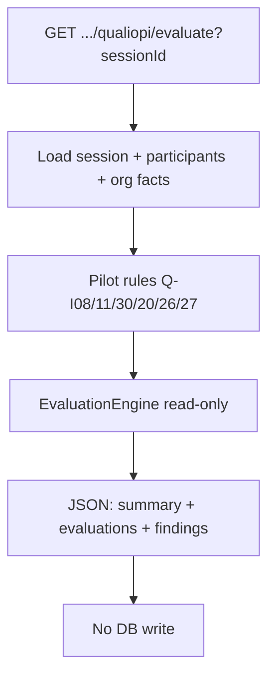

# Plan — Qualiopi Q1 Evaluation Engine + Stress Test Session

**Statut :** en attente validation utilisateur  
**Périmètre :** Q0 formalisé + Q1 moteur + Q2 API stress test (sans UI, sans Prisma)

---

## Objectif

Livrer le plus petit backend permettant de **mettre à l’épreuve une session** :

```
READ STATE → APPLICABILITY → RULES → EVALUATION → FINDINGS → JSON
```

Sans écrire en base, sans marquer conforme, sans toucher n8n / classeur / schema.

---

## Hors scope (explicite)

- Pas de migration Prisma / nouvelles tables
- Pas de page Passeport / datatable sessions
- Pas de refactor UI classeur / couverture / historique
- Pas de LLM
- Pas de modification circuits n8n
- Pas d’extension de `ComplianceService` (reste GED)

---

## Livrables

### 1. Doc Q0 (matrice + règles pilotes)

Fichier : `docs/QUALIOPI-Q0-CAPABILITY-MATRIX.md`

- Matrice 32 indicateurs (scopes / sources / gaps) — synthèse audit
- 6 règles pilotes Q1 retenues
- Convention des statuts : `PASS | FAIL | WARNING | NOT_APPLICABLE | NOT_VERIFIABLE`
- `rulesVersion = qualiopi-engine-q1.0`

### 2. Moteur déterministe

Fichiers (placement aligné coverage/gaps) :

| Fichier | Rôle |
|---------|------|
| `apps/lms-crm/lib/of/qualiopi-evaluation-types.ts` | Types result / finding / status |
| `apps/lms-crm/lib/of/qualiopi-evaluation-rules.ts` | 6 règles pilotes (predicates) |
| `apps/lms-crm/lib/of/qualiopi-session-evaluate.ts` | Charge faits session + org, exécute règles, agrège |

**Règles pilotes :**

| Code | Scope | Source de vérité | Critère PASS (déterministe) |
|------|-------|------------------|-----------------------------|
| Q-I08 | SESSION + BENEFICIARY | `CandidatureAssessment` `POSITIONING` | tous participants confirmés avec candidature → assessment COMPLETED ; sinon FAIL/WARNING selon ratio |
| Q-I11 | SESSION + BENEFICIARY | `FormativeAssessment` (participant) | ≥1 évaluation formative par participant confirmé ; sinon FAIL/WARNING |
| Q-I30 | SESSION | `SatisfactionSurvey` | ≥1 survey HOT/COLD COMPLETED (ou SENT si session encore RUNNING → WARNING) |
| Q-I20 | ORGANIZATION | `SystemSetting.disabilityReferent*` | nom référent renseigné → PASS ; sinon FAIL (hérité par session) |
| Q-I26 | ORGANIZATION | même + adaptations | référent OK → PASS ; si adaptations pending → WARNING |
| Q-I27 | ORGANIZATION | `SubcontractorRecord` | si aucun sous-traitant → NOT_APPLICABLE ; si tous APPROVED/ACTIVE → PASS ; REVIEW/PENDING → WARNING ; SUSPENDED → FAIL |

**Statuts :**

- Pas de faux PASS : si données insuffisantes → `NOT_VERIFIABLE`
- Org rules héritent sur la session sans dupliquer Evidence
- Evidence / EvidenceIndicatorLink consultés en **complément** (preuve auto existante) mais la règle métier reste la source

**Finding structuré (in-memory) :**

```ts
{
  indicatorCode, status, scope, entityType, entityId?,
  reasonCode, explanation, expected, observed,
  missingEvidence?, actionTarget, severity
}
```

`actionTarget` = chemin CRM réel (ex. suivi-formations session, referent-handicap, sous-traitants).

### 3. API Stress Test (read-only)

Fichier : `apps/lms-crm/app/api/sections/gestion-ressources/qualiopi/evaluate/route.ts`

- `GET /api/sections/gestion-ressources/qualiopi/evaluate?sessionId=...`
- Auth : `requireGestionRessourcesView` (comme gaps)
- Appelle `evaluateSessionQualiopi(prisma, sessionId)`
- Réponse `ok({ ... })` — **aucune écriture**
- 404 si session introuvable ; 422 si sessionId manquant

### 4. Handoff

Entrée datée en haut de `docs/HANDOFF-CURSOR.md`.

---

## Architecture (flux)



---

## Ordre d’implémentation

1. Types + constantes `rulesVersion`
2. Rules predicates (pure functions sur faits chargés)
3. `evaluateSessionQualiopi` (loaders Prisma + run)
4. Route API
5. Doc Q0 matrice
6. Smoke manuel : appeler l’API sur une session locale (si dispo)
7. Handoff Cursor

---

## Critères d’acceptation

- [ ] `tsc` / lint OK sur fichiers touchés
- [ ] GET evaluate sans sessionId → 422
- [ ] Session inconnue → 404
- [ ] Session réelle → JSON avec `rulesVersion`, counts PASS/FAIL/…, findings avec `actionTarget`
- [ ] Aucune mutation Prisma dans le chemin evaluate
- [ ] Classeur / coverage / n8n inchangés

---

## Suite (hors ce chantier)

- Q3 Passeport UI
- Q4 Datatable sessions
- Q5 Vue org evaluate
- Q6 Snapshots persistés (si besoin reproductibilité)
- Q7 Auditor pack

---

## Décision à confirmer

**Go pour ce périmètre Q1+API (sans UI) ?**